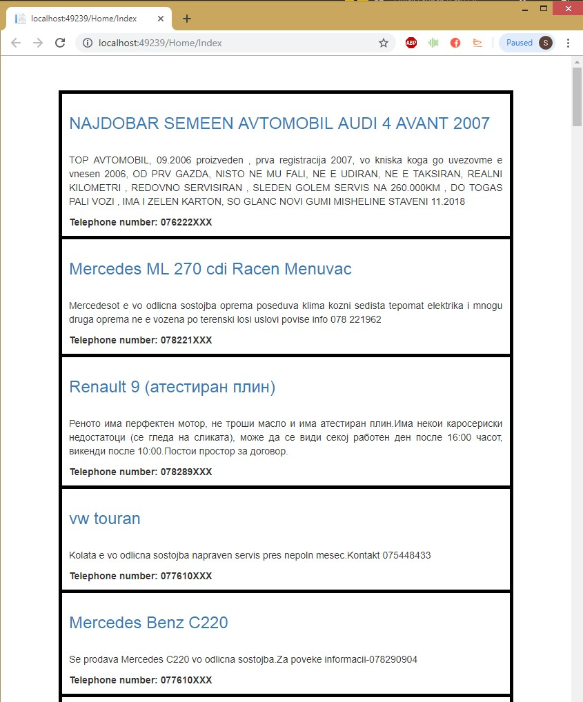

# Web scraper using .NET framework

# Scraping car ads from Macedonian website reklama5.mk using ASP.NET MVC

# Short demo


# Getting the data
Reklama5 is Macedonian advertisment webpage. We are getting the query "Search?q=&city=&sell=0&sell=1&buy=0&buy=1&trade=0&trade=1&includeOld=0&includeOld=1&includeNew=0&includeNew=1&f31=&priceFrom=&priceTo=&f33_from=&f33_to=&f36_from=&f36_to=&f35=&f37=&f138=&f10016_from=&f10016_to=&private=0&company=0&page=" + 1 + "&SortByPrice=0&zz=1&cat=24";" from the site (This query is getting all ads for cars in the whole country) and we are incrementing the number of page (in our content that is the 'id' argument) and we are getting the next data from the website. 
In this part of code We are checking if we are on the first page or we have clicked Next button to scrap the next X ads from the site
```
if (id.HasValue)
```
You can see the part of code here
```
var url = "http://reklama5.mk/Search?q=&city=&sell=0&sell=1&buy=0&buy=1&trade=0&trade=1&includeOld=0&includeOld=1&includeNew=0&includeNew=1&f31=&priceFrom=&priceTo=&f33_from=&f33_to=&f36_from=&f36_to=&f35=&f37=&f138=&f10016_from=&f10016_to=&private=0&company=0&page=" + 1 + "&SortByPrice=0&zz=1&cat=24";
if (id.HasValue)
                url = "http://reklama5.mk/Search?q=&city=&sell=0&sell=1&buy=0&buy=1&trade=0&trade=1&includeOld=0&includeOld=1&includeNew=0&includeNew=1&f31=&priceFrom=&priceTo=&f33_from=&f33_to=&f36_from=&f36_to=&f35=&f37=&f138=&f10016_from=&f10016_to=&private=0&company=0&page=" + id.ToString() + "&SortByPrice=0&zz=1&cat=24";
```

Then we are taking the raw HTML code from the site. In the next code we are getting all divs which have class named 'OglasResults' and we are putting them in nodes. So each node means one ad.
```
var divs = htmlDocument.DocumentNode.Descendants("div")
                .Where(node => node.GetAttributeValue("class", "")
                .Equals("OglasResults"))
                .ToList();
```
We are iterating through the ads(nodes) with
```
            foreach (var div in divs)
```
There are two ways of getting the data we need from the div we have. Iterating through the node and childs until we get into the element we need.
```
var time = div.ChildNodes.ElementAt(3).ChildNodes.ElementAt(2).InnerText;
```
OR we can get XPATH of the element. The easiest way to get the XPATH of the element is using the web browser Google Chrome, inspect element to the element we want to get -> Right click -> Copy -> Copy XPath
```
carDescription = htmlDocument.DocumentNode.SelectSingleNode("/html/body/div[3]/div[3]/div[1]/div[9]/div[1]/div[7]/div[1]/div[7]/p[3]").InnerText;
```
But we do not have all the info we need from the main page above so we must enter to each ad and get elements from that new page. We are getting the href= from each ad and Creating new HttpClient entering there and getting the info we need from there like, sellername, sellerphone, etc

```
var carLinkToDescription = div.ChildNodes.ElementAt(6).ChildNodes.ElementAt(0).ChildNodes.ElementAt(0).Attributes.ElementAt(0).DeEntitizeValue;
```
Before all of this loop we have created Link of the Model of carAds
```
public string time { get; set; }
        public string carName { get; set; }
        public string carPrice { get; set; }
        public string carDescription { get; set; }
        public string carLocation { get; set; }
        public string carSellerName { get; set; }
        public string carSellerPhone { get; set; }
        public string carLinkToDescription { get; set; }
```
And when we finish with getting info from one ad, we are putting all info to the list and go to the next ad. When all of this finish we are sending the data to the View.

```
return View(carAds);
```
There is method hideLastDigit for hidding the last 3 numbers of the telephone number because of security reasons
```
public string hideLastDigit(string telephoneNumber)
        {
            string newTelephoneNumber = telephoneNumber.Remove(telephoneNumber.Length - 3) + "XXX";
            return newTelephoneNumber;
        }
```
With click on every title link you are redirecting to the original reklama5 ad. You can override this on Description controller.

# USE THIS AT YOUR OWN RISK
This website has policy for personal data protection. Read more about this on http://reklama5.mk/Help/HelpTerms

# // To do
Grab ads of only specific models of cars  
Grab ads of only on specific range of prices  
Grab ads of only on specific Macedonian city
